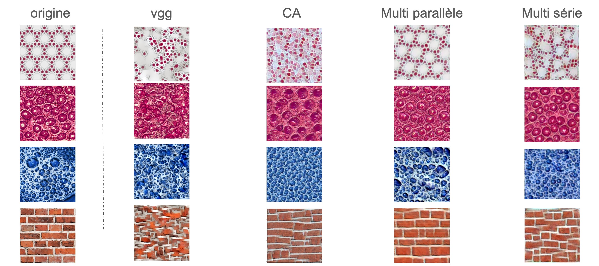

# PROJ104 - Génération de texture par réseau convolutionnel

synthese-image-2

## Membres 
+ POTTIER Lucas
+ Kilian Berlivet
+ Martin De Bats
+ Romain Planchon

## Ressources

### Articles de recherche

[1] L. A. Gatys, A. S. Ecker, and M. Bethge, Texture Synthesis Using Convolutional Neural Networks
Advances in Neural Information Processing Systems 28, 2015   Web Site

[2] Texture Generation with Neural Cellular Automata, A. Mordvintsev, E. Niklasson and E. Randazzo, preprint, 2021

### Autres
https://storimaging.github.io/notebooksImageGeneration/

https://perso.telecom-paristech.fr/anewson/doc/courses/cnn/convolutional_neural_networks.pdf

https://pytorch.org/tutorials/

## Description du projet

Après avoir étudié un algorithme de génération de textures utilisant VGG [1], nous avons cherché à implémenter l'algorithme basé sur un automate cellulaire décrit dans [2] (situé dans /neuralCA). 
Les limitations en particulier concernant la detection de structures à grande échelles nous a amené à dévelloper 2 architectures de réseaux multi-résolutions basé sur la même base d'automate cellulaire. L'un utilisant 3 réseaux de neuronnes en parallèle et l'autre les mettant en série (cf / multiresolution_parallele et /multiresolution_serie).

Les caractéristiques des différents architectures sont détaillés dans les dossiers correspondant

Nous allons nous intéressez ici à une comparaison général des résultats des différents architecture.

## Comparaison des résultats

### Analyse générale

1. VGG: 
Les résultats montrent des détails texturaux, mais avec des déformations et une perte de clarté par rapport à l'original.

2. CA: 
Les textures générées par l'algorithme CA conservent mieux les structures locales mais montrent des limitations dans la capture des grandes échelles.

3. Multi parallèle: 
Cette approche multi-résolution conserve bien les motifs globaux et les détails locaux, offrant une bonne balance entre les deux.

4. Multi série: 
Semblable à l'approche parallèle, cette méthode en série montre une bonne conservation des détails et des structures à grande échelle. Les résultas reste un peu inférieur en qualité comparé à la la structure en parallèle.

### Rapport Moral

Notre rapport Moral est disponible dans le pdf synthese-image-2.pdf
